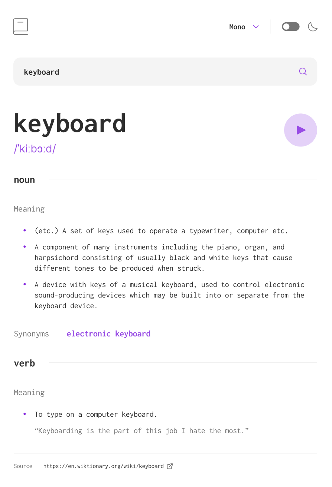
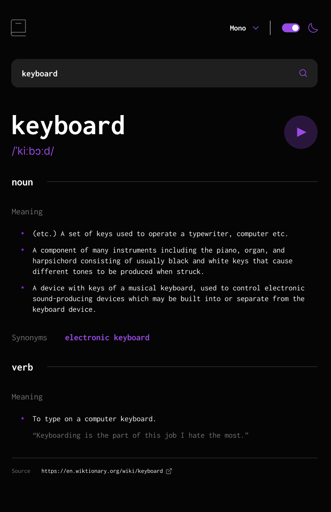

# 📖 Dictionary App

A modern and responsive **Dictionary Web Application** that allows users to search for any English word and get its **definition, synonyms, part of speech (noun/verb, etc.), pronunciation, and phonetics**.  
The app features **light & dark mode**, custom **font selection**, and real-time updates using an external API.

---

## 🚀 Features

- 🔍 Search any English word
- 📖 View **definitions, synonyms, noun/verb forms, and pronunciation**
- 🎧 Listen to word pronunciation
- 🌗 **Light/Dark mode** toggle
- 🔤 Change **font family** via dropdown select
- 📱 Fully **responsive design** (desktop, tablet, mobile)
- 🌐 API-powered results (real-time word search)
- 🎨 Built with **SASS 7-1 Architecture Pattern** for scalable styles

---

## 🛠️ Technologies Used

- **HTML5**
- **SASS/SCSS** (7-1 pattern architecture)
- **JavaScript (ES6)**
- **Dictionary API** (for fetching word data)

---

## 📂 Project Structure

SASS follows the **7-1 architecture** pattern:

---

## 🌍 Demo

🔗 **Live Demo:** [View on Vercel](https://dictionary-web-app-beta-ochre.vercel.app/)

---

## 📸 Screenshots

### 🌞 Light Mode



### 🌙 Dark Mode



---

## 📦 Installation & Usage

1. Clone the repository:
   ```bash
   git clone https://github.com/khamzaevasad/dictionary-web-app.git
   cd dictionary-app
   ```
